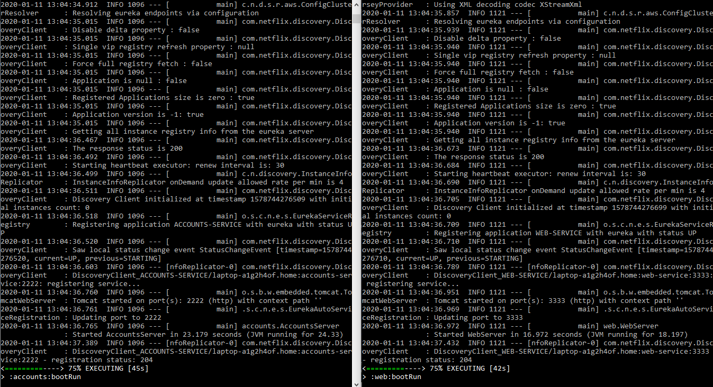
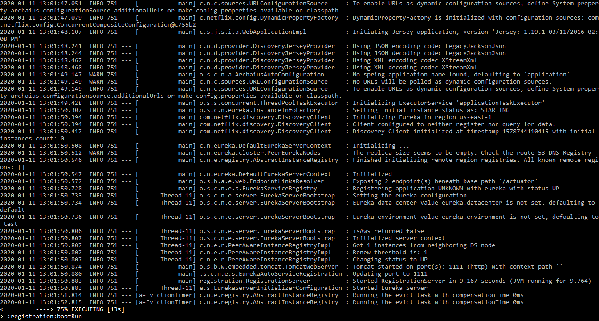
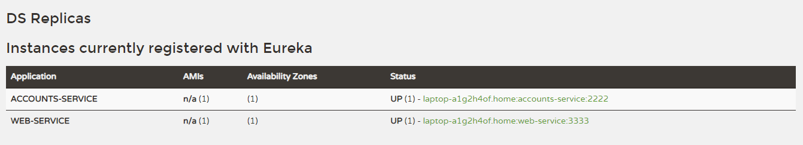
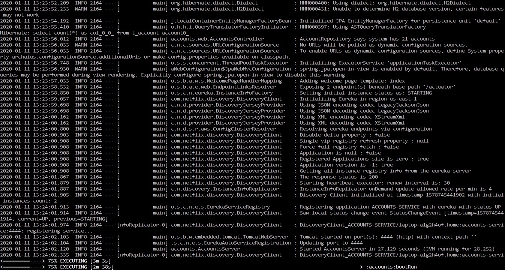
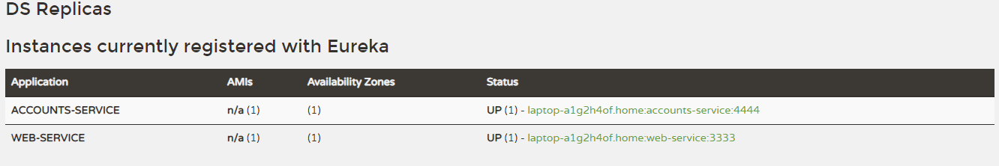
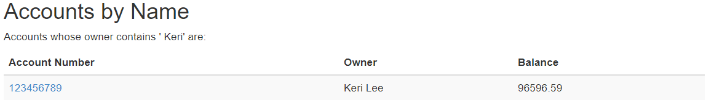

## 1. The two microservices are running and registered



Logs:
```
2020-01-11 13:12:35.705  INFO 1270 --- [nio-1111-exec-9] c.n.e.registry.AbstractInstanceRegistry  : Registered instance ACCOUNTS-SERVICE/laptop-a1g2h4of.home:accounts-service:2222 with status UP (replication=false)
```
```
2020-01-11 13:13:15.208  INFO 1270 --- [nio-1111-exec-5] c.n.e.registry.AbstractInstanceRegistry  : Registered instance WEB-SERVICE/laptop-a1g2h4of.home:web-service:3333 with status UP (replication=false) 
```

## 2. The service registration service has the two microservices registered





## 3. A second account microservice is running in the port 4444 and it is registered



Log:
```
2020-01-11 13:24:02.321  INFO 1772 --- [nio-1111-exec-6] c.n.e.registry.AbstractInstanceRegistry  : Registered instance ACCOUNTS-SERVICE/laptop-a1g2h4of.home:accounts-service:4444 with status UP (replication=false)
```

## 4. Killing the microservice with port 2222




After the first account microservice is killed the web service can still provide information about the accounts since the one launched with port 4444 holds the information (replica).

