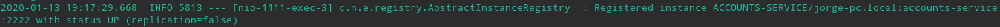
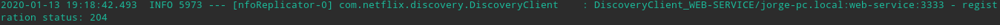
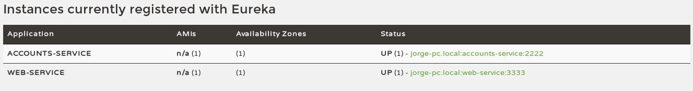
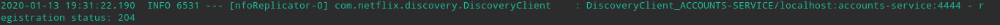
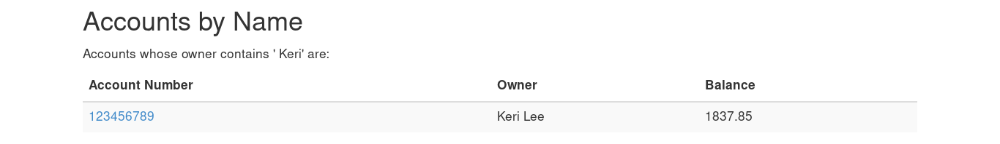

## 1. The two microservices are running and registered

## 2. The service registration service has the two microservices registered

## 3. A second account microservice is running in the port 4444 and it is registered

## 4. Killing the microservice with port 2222

After kill the account microservice with port 2222, the account microservice on port
4444 is still alive, so because of replication, data is still accesible

